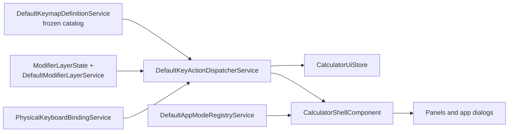

# App Shell Architecture

The app shell is the static skeleton of the instrument: the status strip, the
display, the layered keypad, and the dialogs that host panels and apps. All of
its behavior is data-driven and testable.

## Keymap catalog

`DefaultKeymapDefinitionService` is a frozen catalog of `KeyDefinition` objects.
Each key carries a primary layer and optional SHIFT and ALPHA layers; each
layer carries a label, an accessible name, and a `KeyAction`. The catalog is
deep-frozen at construction so the instrument layout cannot drift at runtime.

## Modifier layers

`ModifierLayerState` is an immutable value object holding the armed layer
(`NONE`, `SHIFT`, or `ALPHA`). `DefaultModifierLayerService` implements the
transition rules: arming one modifier disarms the other, `consume` returns the
armed layer and disarms it, and `disarm` clears without side effects. The store
holds the current `ModifierLayerState` and the status strip mirrors it.

## Dispatcher

`DefaultKeyActionDispatcherService` resolves the active layer for a keycap and
routes its `KeyAction` to the store's action surface. It returns the used layer
so the keypad can consume the armed modifier after a layered press. Keyboard
events from `PhysicalKeyboardBindingService` route through the same dispatcher,
so keycaps and the hardware keyboard share one behavior.

## Physical keyboard bindings

`PhysicalKeyboardBindingService` maps hardware keys to calculator actions:
digits and operators type directly, `Enter` evaluates, `Backspace` deletes,
`F1`-`F6` map to SHIFT, ALPHA, menu, S-D, CALC, and SOLVE, and `PageUp` /
`PageDown` walk history. Keys that a focused control already handles natively
(typing in the expression editor) are left untouched.

## App registry

`DefaultAppModeRegistryService` registers the ten apps with their numeric
badges. Shipped apps are available and render through
`CalculatorAppViewComponent`, which switches on the active app id: the
calculate app shows the classic display and keypad, and every other app renders
its dedicated app component. The last active app persists to `localStorage` and
is restored at bootstrap.

## App view routing

`CalculatorShellComponent` renders `CalculatorAppViewComponent` whenever the
active app is not the calculate app, keeping the status strip and dialogs
unchanged. Each app component is self-contained: it reads services from the
composition root, keeps its editor state locally, and reports clear errors for
invalid input. Apps that are not yet delivered stay unavailable in the registry
so the home menu shows their availability reason instead of a dead entry.

## Wiring

All services are constructed in `CalculatorCompositionRoot` and injected. The
store is a thin Zustand layer: it holds UI state and forwards actions to the
controller and services. React Aria provides every interactive primitive, and
keycap buttons use `preventFocusOnPress` so pressing them never steals focus
from the expression editor.

## Next steps

- [Layers](/architecture/layers)
- [State machine](/architecture/state-machine)
- [Keyboard handling](/architecture/keyboard-handling)
- [Keymap reference](/user-guide/keymap-reference)
