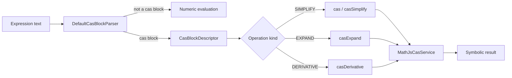

# CAS Routing

CAS blocks are recognized at the top level of an expression and routed to the symbolic engine before numeric evaluation.

## Flow diagram



## Parser

`DefaultCasBlockParser` matches the top-level block pattern:

```
/^(cas|casSimplify|casExpand|casDerivative)\s*\((.*)\)$/s
```

It produces a `CasBlockDescriptor` carrying the operation kind, the inner expression text, and an optional derivative variable.

## Router

`DefaultCasExpressionRouterService` routes the descriptor to the CAS service:

- `cas(...)` and `casSimplify(...)` simplify.
- `casExpand(...)` expands.
- `casDerivative(...)` differentiates.

## Service

`MathJsCasService` implements `CasService` using the math.js instance. It is the only place that touches symbolic operations.

## Why routing matters

Routing keeps symbolic expressions out of the numeric gateway and keeps the numeric engine from choking on symbolic input.

## CAS enabled flag

Routing consults the `casEnabled` flag. When CAS is disabled, `cas(...)` blocks are not treated as symbolic and fail with an error.

## Next steps

- [CAS overview](/cas/overview)
- [Adding a CAS operation](/developer/adding-a-cas-operation)
