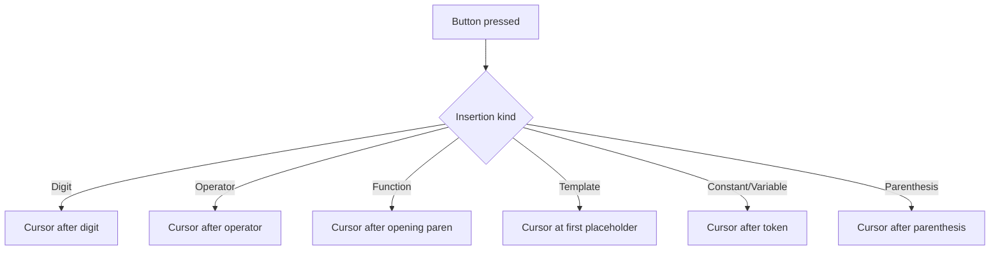
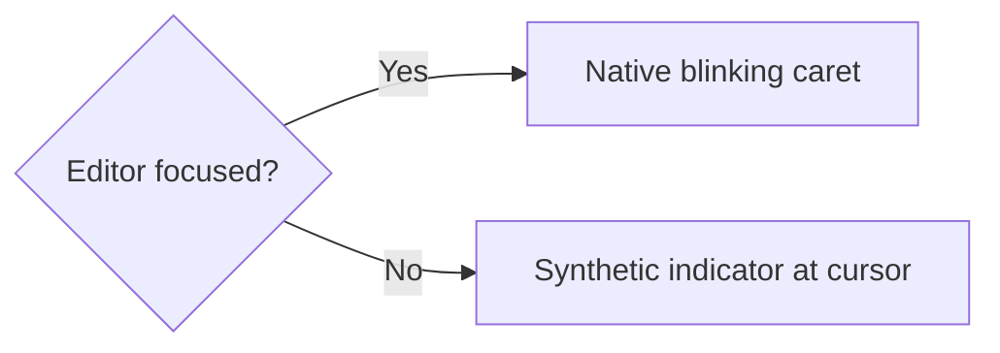
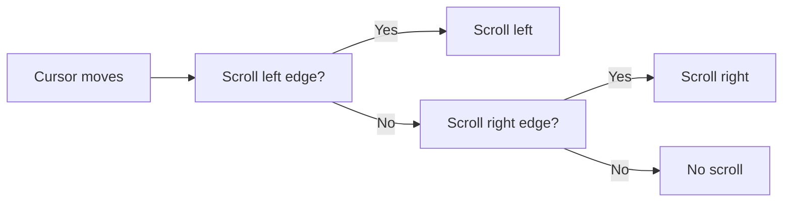

# Cursor Management

Cursor management is a deliberate, service-based subsystem. It guarantees the
caret always lands at the logically correct position and stays visible.

## Responsibilities

| Concern | Service |
| ------- | ------- |
| Cursor placement rules | `ExpressionCursorService` |
| Insertion orchestration | `ExpressionInsertionService` |
| Button insertion templates | `ButtonInsertionTemplateService` |
| Caret visibility | `ExpressionEditorCaretRenderingService` |
| Horizontal scrolling | `ExpressionEditorScrollService` |
| Focus preservation | `FocusPreservationService` |
| Selection resolution | `ExpressionEditorSelectionService` |

## Cursor placement rules

## Caret visibility model

The native input caret is authoritative while the editor is focused. When
focus moves to a button, a synthetic indicator renders at the cursor position.

The synthetic caret is positioned using a hidden measure of the text before
the cursor so it always matches the logical position.

## Scroll model

The editor scrolls horizontally to keep the caret visible:

## Focus preservation

After a button press, focus behavior depends on the input device:

- Mouse click: focus returns to the expression editor so typing continues.
- Keyboard activation: focus stays on the button for grid navigation, and the
  synthetic caret keeps the cursor visible.

## Next steps

- [Expression editing model](/architecture/expression-editing-model)
- [Expression editing guide](/user-guide/expression-editing)
