# Diagrams

This page collects the architecture diagrams of the calculator.

## Layer architecture

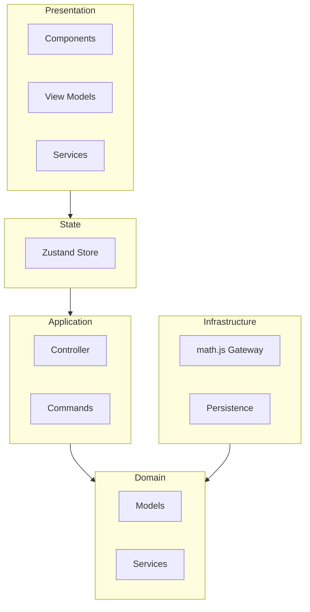

## Evaluation pipeline

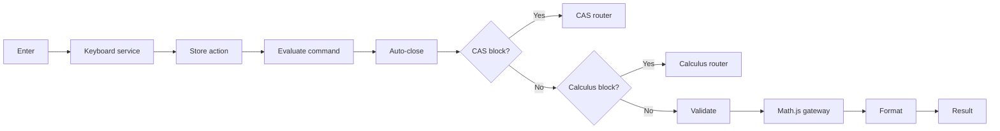

## CAS routing

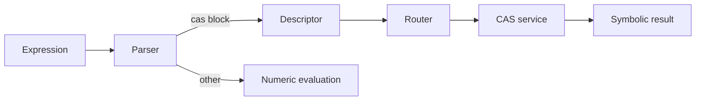

## Calculus routing

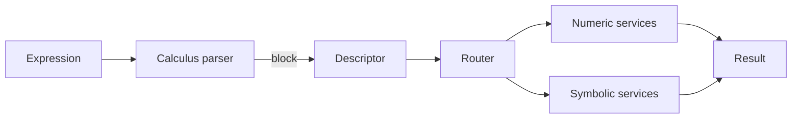

## State transitions

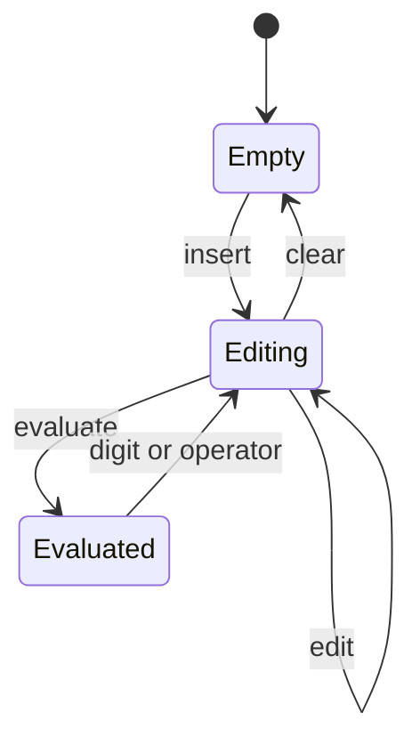

## Persistence flow

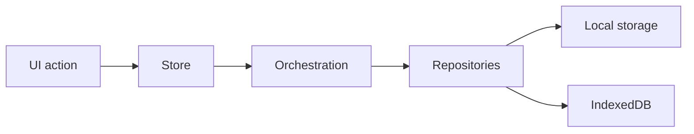

## Keyboard command flow

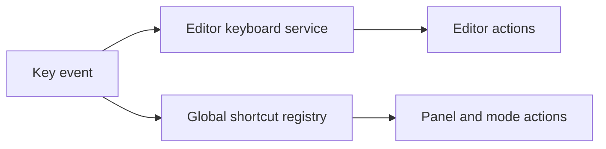

## Composition root wiring

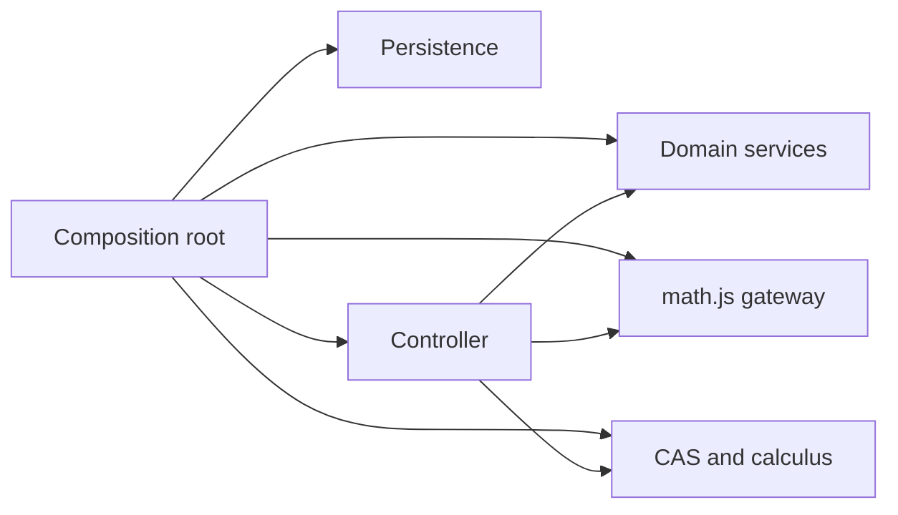

## Expression editing model

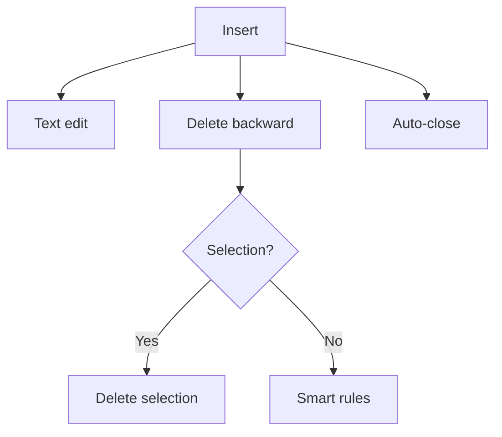

## Cursor management model

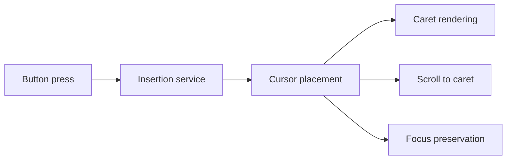

## Numeric mode policy

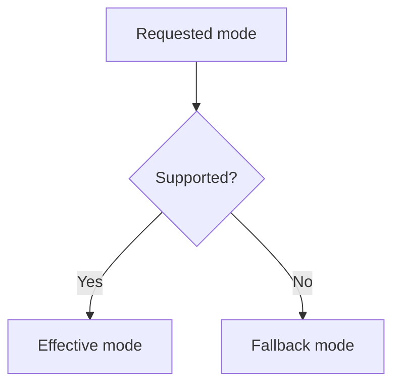

## BigInt fallback flow

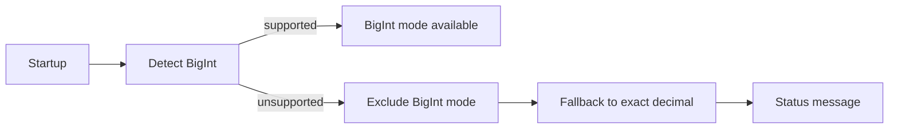

## Next steps

- [Layers](/architecture/layers)
- [Cursor management](/architecture/cursor-management)
