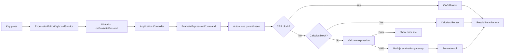

# Evaluation Pipeline

This page traces an expression from the moment the user presses `Enter` to the
rendered result.

## Flow diagram

## Step by step

1. **Key press** — the user presses `Enter` in the expression editor.
2. **Keyboard service** — `ExpressionEditorKeyboardService` maps `Enter` to
   `onEvaluatePressed`.
3. **Store action** — `onEvaluatePressed` maps UI state to session state and
   invokes the controller.
4. **Command** — `EvaluateExpressionCalculatorCommand` runs.
5. **Auto-close** — unbalanced parentheses are closed.
6. **CAS routing** — if the expression is a `cas(...)` block, it routes to the
   CAS router.
7. **Calculus routing** — otherwise, a calculus block routes to the calculus
   router.
8. **Validation** — the expression is validated against the function and
   constant catalogs.
9. **Evaluation** — the math.js gateway evaluates through the whitelist and
   controlled scope.
10. **Formatting** — the result is formatted according to the numeric mode.
11. **Presentation** — the result renders in the result line and is recorded
    in history.

## Error handling

- Validation errors render in the error line.
- Calculation errors are mapped to typed errors.
- Unexpected failures render a generic error message.

## Next steps

- [CAS routing](/architecture/cas-routing)
- [State machine](/architecture/state-machine)
