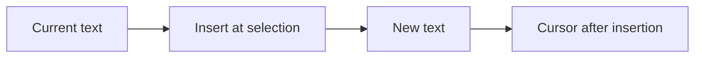
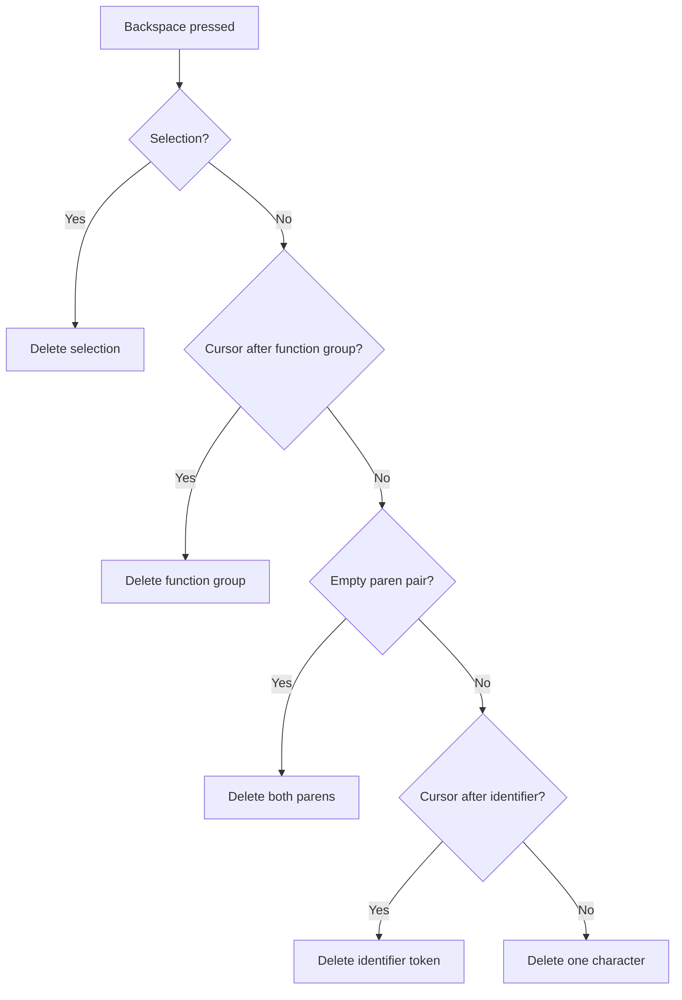
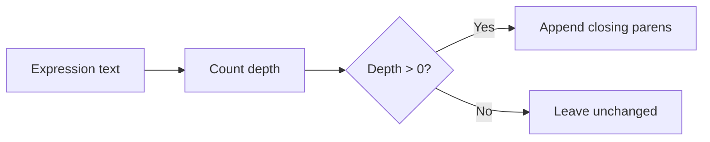

# Expression Editing Model

The expression editing model is the domain layer's contract for editing text: insertion, deletion, and auto-closing parentheses.

## The edit result

Every editing operation returns an `ExpressionTextEdit`:

```ts
export interface ExpressionTextEdit {
    readonly text: string;
    readonly cursorPosition: number;
    readonly selectionStart: number;
    readonly selectionEnd: number;
}
```

## The service

`ExpressionEditingService` exposes five operations:

- `insertText` — insert text at the selection.
- `deleteBackward` — smart deletion rules.
- `deleteForward` — forward deletion rules.
- `deleteWordBackward` — token deletion.
- `autoCloseParentheses` — balance parentheses for evaluation.

## Insertion model

Insertion replaces the selection with the inserted text and places the cursor after the inserted text:



## Smart deletion model

`deleteBackward` applies rules in order:



## Auto-close model

`autoCloseParentheses` counts unbalanced opening parentheses and appends the matching closing parentheses:



## Cursor placement rules

The presentation layer enforces the cursor placement rules on top of this model:

- Digit: cursor after the digit.
- Operator: cursor after the operator.
- Function: cursor inside the parentheses.
- Template: cursor at the first placeholder.

See [Cursor management](/architecture/cursor-management).

## Next steps

- [Cursor management](/architecture/cursor-management)
- [Smart backspace](/user-guide/smart-backspace)
