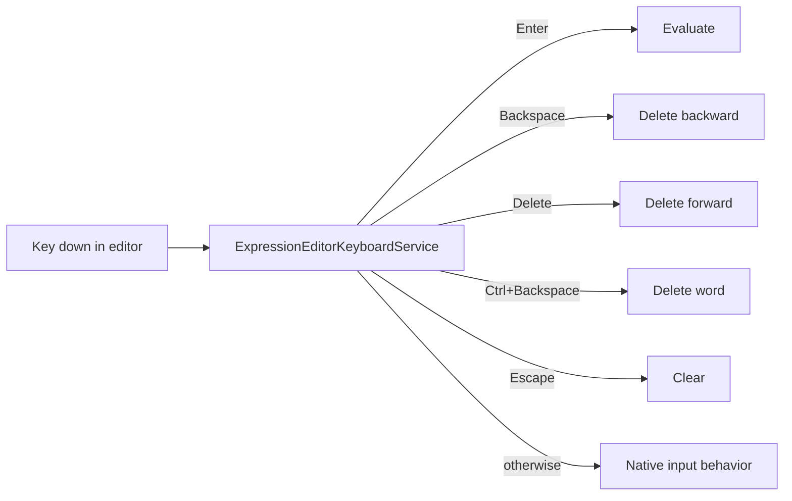
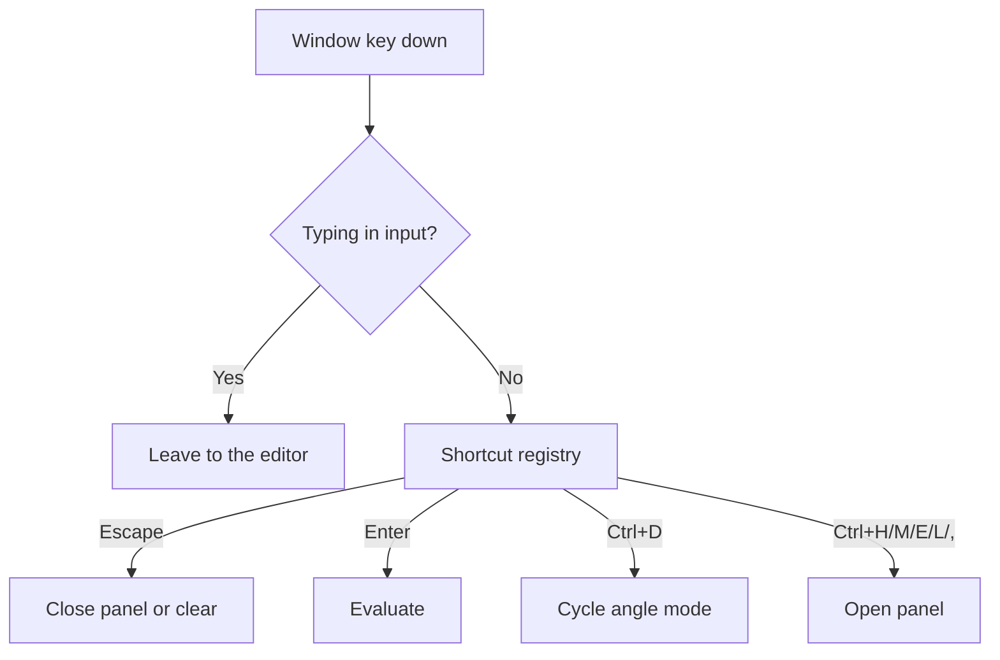

# Keyboard Handling

Keyboard input is handled in two places: inside the expression editor and at
the window level for global shortcuts.

## Editor keyboard flow

`ExpressionEditorKeyboardService` decides whether a key is handled and reports
it so the component can prevent default browser behavior. Arrow keys, Home,
and End are intentionally left to the native input.

## Global shortcut flow

Window-level shortcuts are resolved by `CalculatorKeyboardShortcutRegistry`
through the `useCalculatorKeyboardBindings` hook.

## Modifier shortcuts

| Shortcut | Action |
| -------- | ------ |
| `Ctrl+D` | Cycle the angle mode |
| `Ctrl+H` | Open history |
| `Ctrl+M` | Open memory |
| `Ctrl+E` | Open constants |
| `Ctrl+,` | Open settings |
| `Ctrl+L` | Open calculus |

## Keypad grid navigation

Each keypad grid exposes one tab stop. `useKeypadGridNavigation` handles
arrow-key movement inside the grid, and `Enter` or `Space` activates the
focused key through React Aria.

## Focus preservation

Button presses preserve the expression editor caret. When focus leaves the
editor, a synthetic caret indicator keeps the cursor visible. See
[Cursor management](/architecture/cursor-management).

## Next steps

- [Keyboard shortcuts](/user-guide/keyboard-shortcuts)
- [Expression editing model](/architecture/expression-editing-model)
