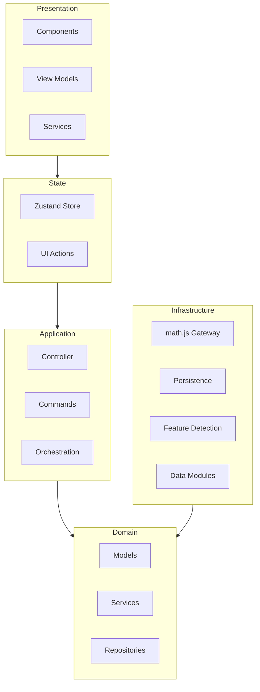

# Layers

The calculator is built from five layers with a strict one-way dependency direction.

## Layer diagram

## Responsibility table

| Layer          | Responsibility                                            |
| -------------- | --------------------------------------------------------- |
| Presentation   | Render UI, forward events, prepare view models            |
| State          | Adapter between UI actions and the application controller |
| Application    | Commands, routing, orchestration                          |
| Domain         | Pure models and business rules, no external dependencies  |
| Infrastructure | Math engine, storage, feature detection, static data      |

## Dependency rules

- Presentation imports State only.
- State imports Application only.
- Application imports Domain only.
- Infrastructure implements Domain interfaces and is wired by the composition root.
- Domain never imports any other layer.

## Why this works

- Domain logic is pure and instant to test.
- The math engine is replaceable behind the gateway.
- JSX stays thin because services own the logic.
- The composition root is the only place that wires concrete classes.

## Next steps

- [Architecture overview](/developer/architecture-overview)
- [Diagrams](/architecture/diagrams)
