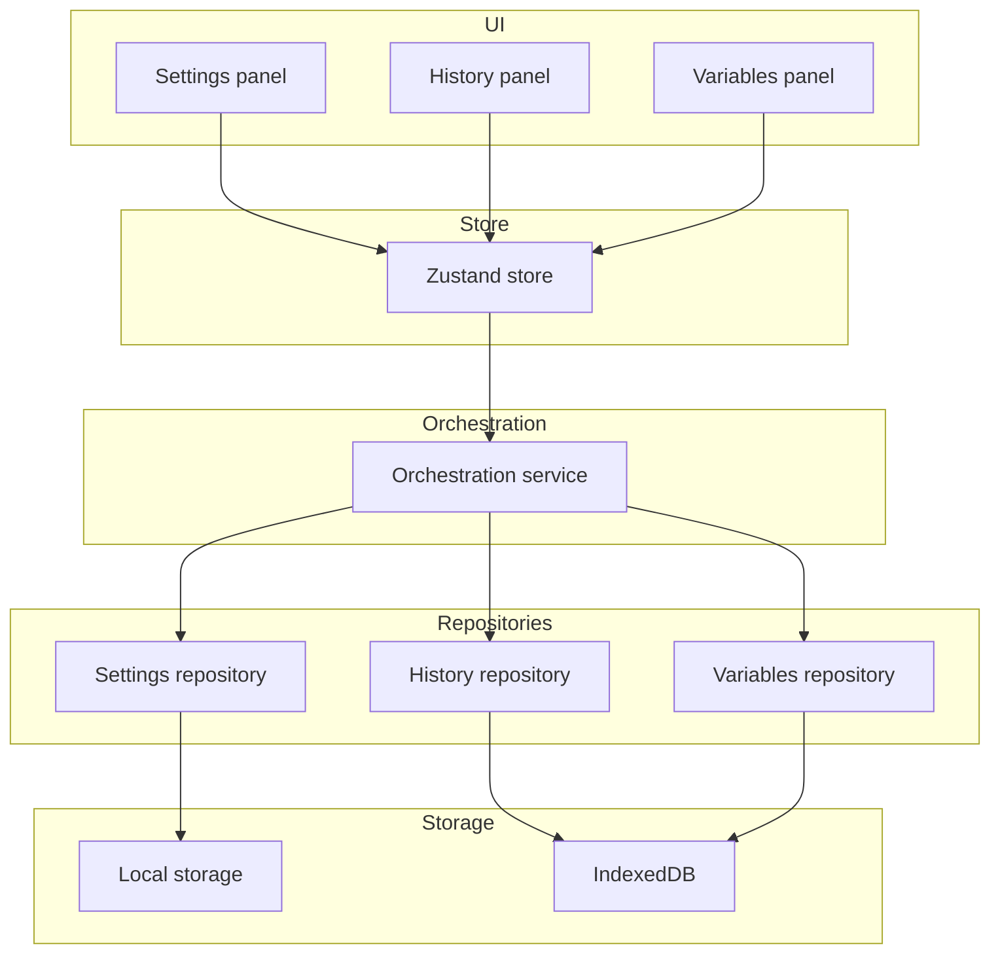

# Persistence

The calculator persists settings, history, and variables in the browser.

## Storage map

| Data      | Storage       | Repository                       |
| --------- | ------------- | -------------------------------- |
| Settings  | Local storage | `LocalStorageSettingsRepository` |
| History   | IndexedDB     | `IndexedDbHistoryRepository`     |
| Variables | IndexedDB     | `IndexedDbVariablesRepository`   |

## Flow diagram

## Settings

- Settings load at bootstrap and are applied before first paint.
- Theme changes apply immediately and persist.
- Angle mode, numeric mode, complex, and CAS flags persist.

## History

- Every successful evaluation records a history entry.
- Entries persist in IndexedDB across sessions.
- The history panel loads entries asynchronously.

## Variables

- Saved variables persist in IndexedDB.
- The variables panel lists and manages them.

## Fallbacks

When IndexedDB is unavailable, the composition root selects in-memory repositories. See [Composition root](/developer/composition-root).

## Next steps

- [History](/user-guide/history)
- [Settings](/user-guide/settings)
