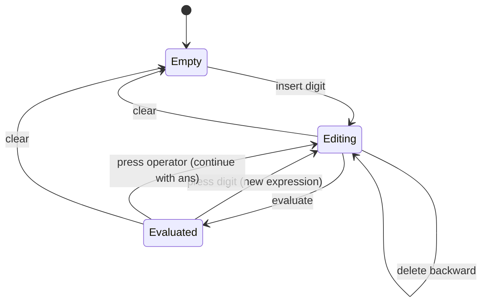

# State Machine

The calculator's session state is an immutable snapshot that transitions
through commands. Every command takes a state and returns a new state.

## State shape

`CalculatorSessionState` carries:

- The expression text and the cursor/selection.
- The result and error text.
- The last result for `ans`.
- The angle mode, numeric mode, and complex/CAS flags.
- Variables and the memory value.

## Transition diagram

## Commands

Each transition is performed by a command:

- Insertion commands update text and cursor.
- Deletion commands apply smart deletion rules.
- `EvaluateExpressionCalculatorCommand` runs the pipeline.
- Mode commands change angle, numeric, complex, or CAS settings.

## Immutability

`copyWith` produces a new state with selected fields overridden. The previous
state is never mutated, which keeps transitions easy to reason about and test.

## UI state mapping

The Zustand store maps session state to UI state and back through
`CalculatorViewModelMapper`. The store never holds domain logic.

## Next steps

- [Command pattern](/developer/command-pattern)
- [State management](/developer/state-management)
