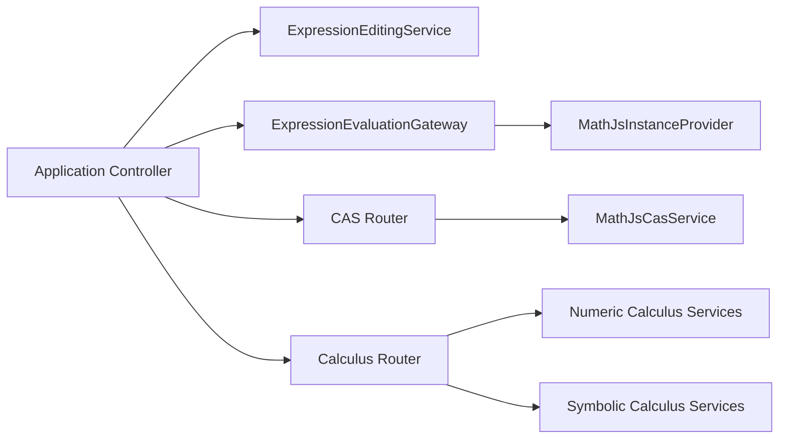

# Composition Root

`CalculatorCompositionRoot` is the single place where every service is
constructed and wired together. Dependencies are passed by constructor
injection.

## Location

```
src/app/
├── CalculatorCompositionRoot.ts    Construction and wiring
├── CalculatorApplicationBootstrap.ts  Startup sequence
└── CalculatorApplicationContext.tsx  React context provider
```

## What the composition root does

1. Constructs feature detection services.
2. Constructs domain services (editing, validation, formatting, catalogs).
3. Constructs the math.js instance and the evaluation gateway.
4. Constructs CAS and calculus services.
5. Chooses persistence repositories (IndexedDB or in-memory fallback).
6. Constructs the orchestration service and the application controller.

## Wiring diagram

The composition root produces a graph with a clear dependency direction:



## Constructor injection everywhere

Every service accepts its dependencies in its constructor. There is no service
locator and no global mutable state.

```ts
this.expressionEvaluationGateway = new MathJsExpressionEvaluationGateway(
  this.mathJsInstanceProvider,
  new MathJsConstantScopeBuilder(...),
  new MathJsFunctionWhitelist(...),
  this.resultFormattingService,
  new MathJsCalculationErrorMapper()
);
```

## Persistence selection

If IndexedDB is unavailable, the composition root falls back to in-memory
repositories:

```ts
if (typeof globalThis.indexedDB === "undefined") {
  return {
    historyRepository: new InMemoryHistoryRepository(),
    variablesRepository: new InMemoryVariablesRepository(),
  };
}
```

## Bootstrap

`CalculatorApplicationBootstrap` runs feature detection, loads settings, applies
the BigInt fallback, and applies the theme to the document.

## Next steps

- [Repository structure](/developer/repository-structure)
- [Architecture overview](/developer/architecture-overview)
